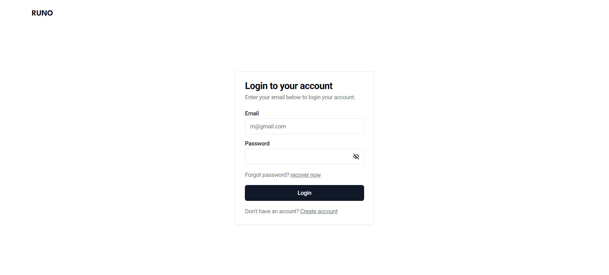
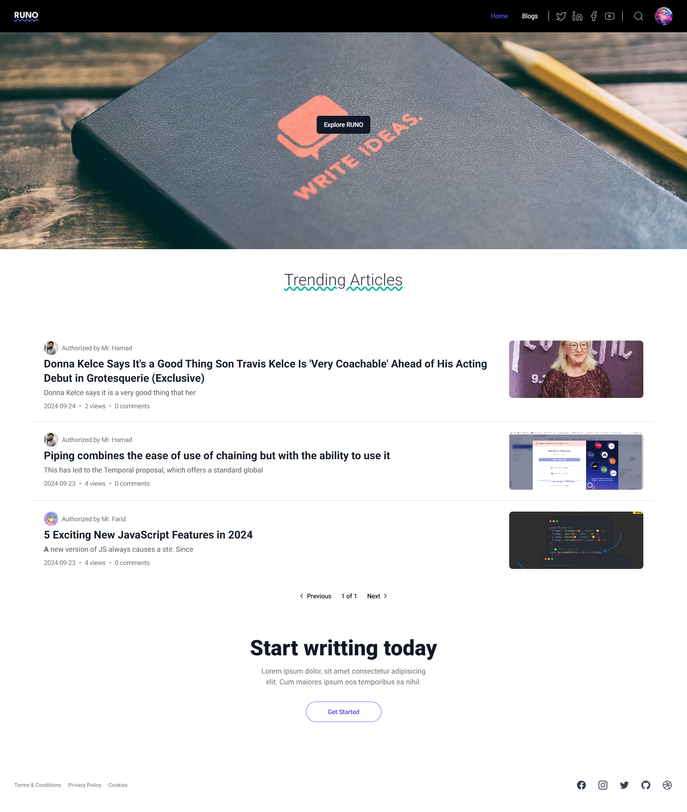
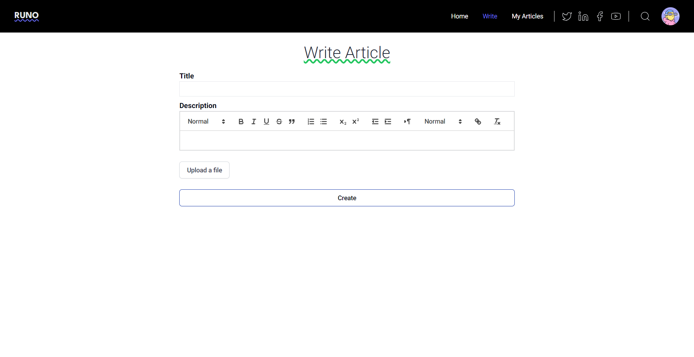
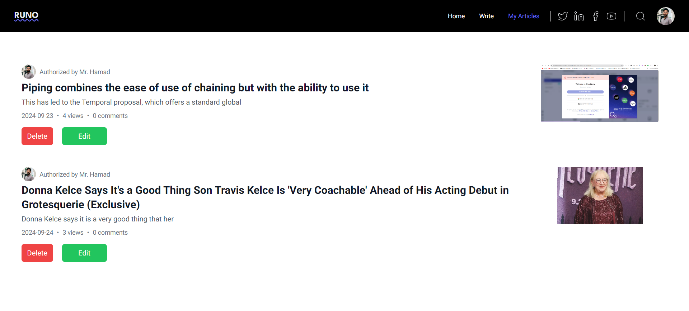
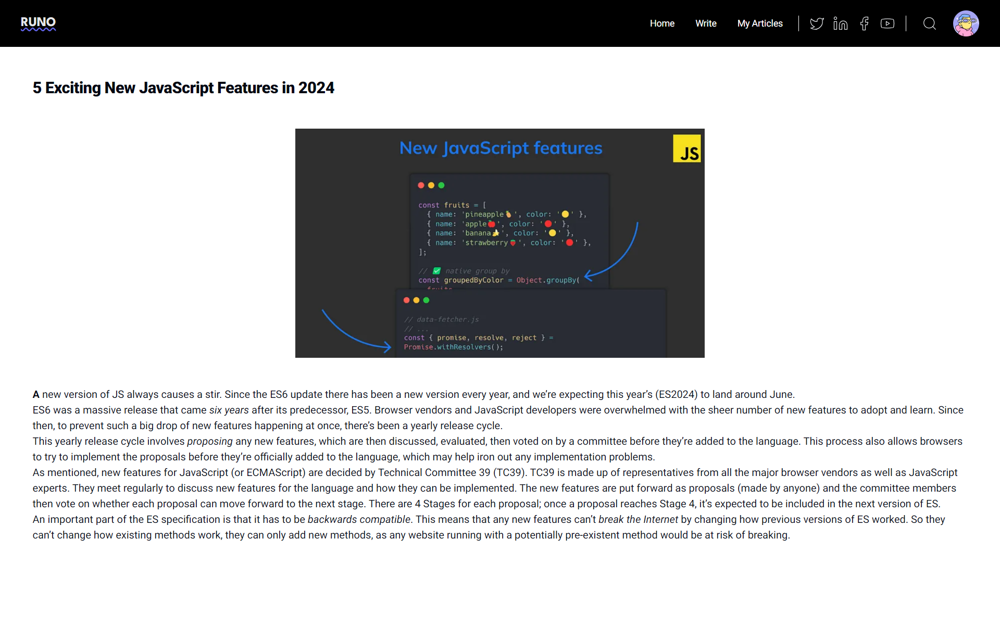
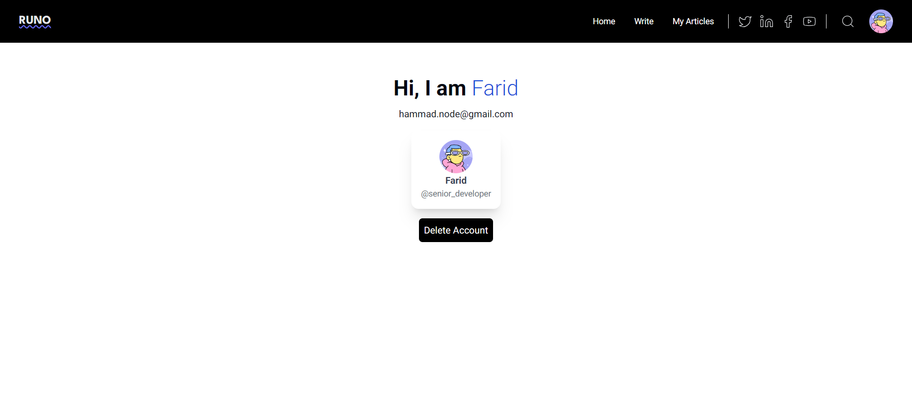

# RUNO - Blogging Webapp

This is a full-featured blogging webapp built using the MERN stack, TailwindCSS, and RTK. The project allows users to create, edit, delete, and update blogs, manage their profiles, and includes pagination and search functionality.

## Features

- **User Authentication**: Sign up, log in, and manage user profiles.
- **Blog Management**: Create, edit, delete, and update blog posts.
- **Pagination**: Efficiently navigate through multiple blog posts.
- **Search Functionality**: Search for specific blog posts.

## Technologies Used

- **Frontend**: React, TailwindCSS, RTK
- **Backend**: Node.js, Express.js, Cloudinary
- **Database**: MongoDB
- **State Management**: Redux Toolkit (RTK)
- **Styling**: TailwindCSS
- **Component Library**: Schadcn

## Installation

1. Clone the repository:
   ```bash
   git clone https://github.com/ChaudaryHammad/RUNO-BLOGG.git
   ```
2. Navigate to the project directory:
   ```bash
   cd RUNO-BLOGG
   ```
3. Install dependencies for both frontend and backend:
   ```bash
   cd backend
   npm install
   cd frontend
   npm install
   ```
4. Add .env inside backend/config

    ```bash

     PORT=8000
     MONGO_URI=
     JWT_SECRET=
     SMTP_HOST="smtp.mailtrap.io"
     SMTP_PORT=2525
     SMTP_USER=
     SMTP_PASS=
     CLOUD_NAME=
     CLOUD_API_KEY=
     CLOUD_API_SECRET=
     NODE_ENV="development"
     Client_URL="http://localhost:3000"

    ```

## Usage

1. Start the backend server:
   ```bash
   npm run dev
   ```
2. Start the frontend development server:
   ```bash
   cd frontend
   npm start
   ```

## Folder Structure

- **/frontend**: Contains the React frontend code.
- **/backend**: Contains the Express backend code.

## Contributing

Contributions are welcome! Please fork the repository and submit a pull request.

## Contact

For any inquiries, please contact `ch.hammadbrw01@gmail.com`.

## Project Images

Here are some screenshots of the project:

### Login Page



### Home Page



### Create Blogs



### User Blogs Page



### Blog Details Page



### Profile Page


